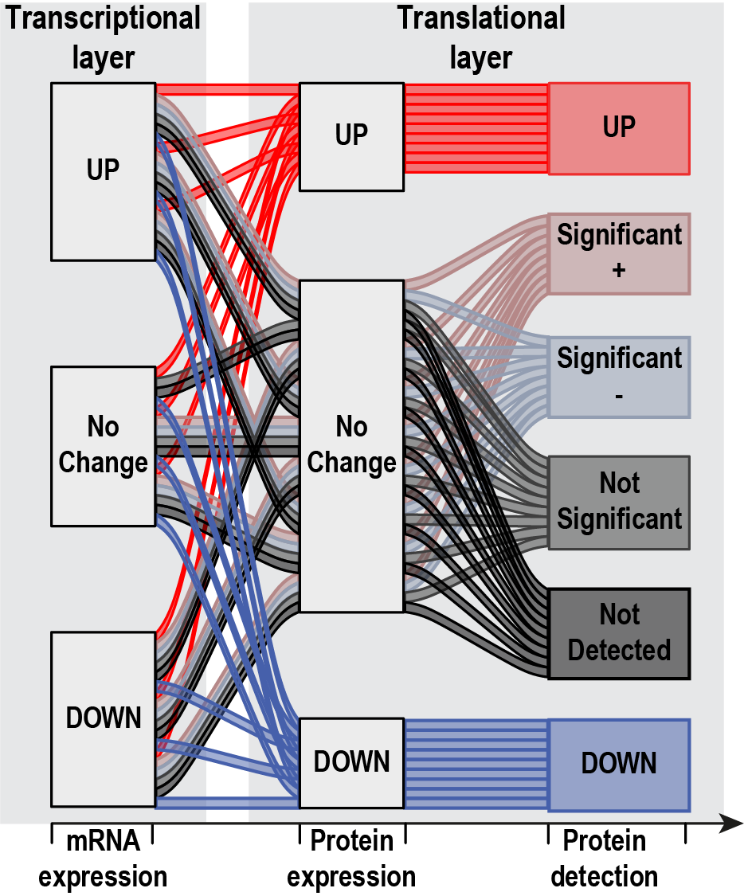
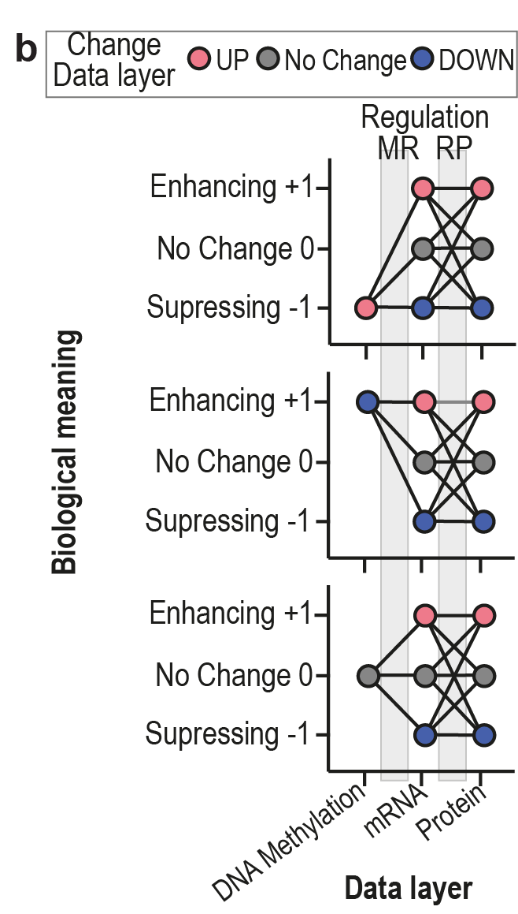

```{r, include=FALSE, warning=FALSE, message=FALSE}
library(tidyverse) # used for data manipulation
library(rmarkdown) # used for paged_table function
library(kableExtra) # used for table
library(dplyr)
```

\
<button type="button" class="btn btn-link disabled" >[**Browse source code**](https://github.com/ArianeMora/SiRCleR/tree/main)</button>

<div class="progress progress-striped active">
  <div class="progress-bar progress-bar" style="width: 100%"></div>
</div>

# ***SiRCle Regulatory Clustering Model***
<div class="progress progress-striped active">
  <div class="progress-bar progress-bar" style="width: 100%"></div>
</div>

This notebook is meant as a guide for choosing the settings for the Signature Regulatory Clustering (SiRCle) dependent on the biological question of interest. This guide is divided into three main chapters that give an overview on the SiRcle method, each covering one of the main settings in the `sircleRCM() functions` (Regulatory Clustering Method) namely the "Background method (BG)", the "Regulation Grouping (RG)" and the thresholds/cutoffs of the input data.\
\
***sircleRCM_MRP()***\
The original Regulatory Clustering Method (RCM) `sircleRCM_MRP()` was developed to perform biologically meaningful clustering integrating DNA methylation, mRNA, and protein data at the gene level. Based on the differential analysis (e.g. Tumour versus Normal), we defined three states, namely positive, negative or unchanged, for each gene and data layer. Given that the protein expression is the data layer closest to the phenotype, yet at the same time has the lowest coverage, “No Change” is subdivided into four states for the protein data layer, “Not Detected”, “Not Significant”, “significant negative” and “significant positive”. For more details and explanation check out the original [publication](https://www.biorxiv.org/content/10.1101/2022.07.02.498058v1.supplementary-material).\
\
<center>
{width=90%}
</center>
\
\
***sircleRCM_RP()***\
It is likely that one only obtained data for the RNA and protein data layer. This is the reason why we also offer the option of the `sircleRCM_RP()` function, which only uses RNAseq and proteomics as input. The above principle stays the same, yet here we one have two 3-state-6-state transitions between the data layers, a total of 18 possible “flows”.\
\
<center>
{width=40%}
</center>
\
\
***sircleRCM_2Cond()***\
Lastly, to enable the application of SiRCle RCM to any two data layers of choice, we provide the `sircleRCM_2Cond()` function. Here one can either input two different data layers, but also the same data layers (e.g. RNAseq comparing KO versus WT in hypoxia and in normoxia). In the above options we take into account that the protein expression is the data layer closest to the phenotype, yet at the same time has the lowest coverage. Here we want to give the full flexibility to the user and hence we have a two 6-state-6-state transitions between the data layers, a total of 36 possible “flows”.\
\
In the next chapters we will discuss how to choose the "Background method (BG)", the "Regulation Grouping (RG)" and the thresholds/cutoffs of the input data.\
\

<div class="progress progress-striped active">
  <div class="progress-bar progress-bar" style="width: 100%"></div>
</div>
# ***1. Background method (BG)***
<div class="progress progress-striped active">
  <div class="progress-bar progress-bar" style="width: 100%"></div>
</div>
The Background setting defines, which features will be considered for the clusters. For example if you have two data layers, RNAseq and proteomics, you could include only features (= genes) that are detected in both data layers, removing the rest of the features.

## ***Three data layers: Methylation, RNAseq and Proteomics***
***1.1. - 1.7.*** goes from most restrictive to least restrictive. Hence the chosen background method will define the number of genes included in the `sircleRCM` input. Given that the proteomics data has the lowest coverage of the three input data layers (Proteomics, RNAseq and DNA-methylation), the proteomics data layer will have the lowest number of detected genes (=features) and hence has the biggest impact on the number of genes included in the `sircleRCM` input.\
\
***1.1. P&M&R***\
Most stringend background setting and will lead to a small number of genes that is mainly dependent on the proteins detected (proteomics data layer), since proteomics has the lowest coverage of the three omics.  
\
***1.2. P&R***\
This background ensures to detect a gene in Proteomics and RNAseq. Similar to 1.1, yet less stringent as the gene does not need to be detected in DNA-Methylation.\
\
***1.3. P|(M&R)***\
Focus is on protein expression. Even though it is unlikely that P&M&R (1.1.) or P&R (1.2.) excludes many proteins, a protein could be excluded if it is not detected on the RNAseq and/or DNA-methylation data layer. Hence, this background  P | (M&R) (1.2.) ensures to include all of the detected proteins (= all features on the proteomics data layer). On the other hand it will also include genes that are not detected on the protein layer (proteomics data), but on the mRNA (RNAseq data) and on for DNA-methylation (DNA-methylation data).\
\
***1.4. (P&M)|(P&R)***\
This background ensures to detect a gene in Proteomics and one of the other two data layers. Similar to 1.1, yet less stringent as the gene does not need to be detected in RNAseq and DNA-Methylation.\
\
***1.5. (P&M)|(P&R)|(M&R)***\
This background ensures to detect a gene in at least two of the three data layers. Hence, the focus moves away from the protein layer (proteomics data layer) and the number of genes that are not detected on the proteomics data layer will increase in comparison to P & M & R (1.1.) and  P | (M&R) (1.2.).\
\
***1.6. P|R***\
A gene will be included in the SiRCle input if it has been detected on one of the two data layers (proteomics or RNAseq).\
\
***1.7. P|M|R***\
Least stringent background method, since a gene will be included in the SiRCle input if it has been detected on one of the three data layers (proteomics, RNAseq or DNA-methylation).\


## ***Two data layers: RNAseq and Proteomics***
As discussed above, often only RNAseq and Proteomics is conducted, and hence there is the `sircleRCM_RP()` function focusing on only those two data layers not requiring the DNA-methylation data. In turn the background methods are the following from ***1.1. - 1.4.*** from most restrictive to least restrictive:

***1.1. P&R***\
Most stringend background setting and will lead to a small number of genes that is mainly dependent on the proteins detected (proteomics data layer), since proteomics has the lower coverage compared to RNAseq.\
\
***1.2. P***\
Focus is on protein expression. Even though it is unlikely that P&R (1.1.) excludes many proteins, a protein could be excluded if it is not detected on the RNAseq data layer. Hence, this background ensures to include all of the detected proteins (= all features on the proteomics data layer).\
\
***1.3. R***\
Focus is on mRNA expression. P&R (1.1.) will exclude many genes from the mRNA data layer, hence this background ensures to include all of the detected mRNAs (= all features on the RNAseq data layer).\
\
***1.4. P|R***\
Least stringent background method, since a gene will be included in the SiRCle input if it has been detected on one of the two data layers (proteomics or RNAseq).\


## ***Two data sets***
Here one can either input two different data layers or two different conditions of the same data layer. In turn the background methods are the following from ***1.1. - 1.4.*** from most restrictive to least restrictive:\
\
***1.1. C1&C2***\
Most stringend background setting and will lead to a small number of genes.\
\
***1.2. C1***\
Focus is on The gene expression of Condition 1 (C1).\
\
***1.3. C2***\
Focus is on The gene expression of Condition 2 (C2).\
\
***1.4. C1|C2***\
Least stringent background method, since a gene will be included in the SiRCle input if it has been detected on one of the two conditions.\
\

<div class="progress progress-striped active">
  <div class="progress-bar progress-bar" style="width: 100%"></div>
</div>
# ***2. Input data threshold***
<div class="progress progress-striped active">
  <div class="progress-bar progress-bar" style="width: 100%"></div>
</div>
Here we can set two different thresholds, one for the differential expression, which would mostly be `Log2FC` for the RNAseq and proteomics data layer and `Differential Methylated Regions (DMR)` for DNA-methylation, and one for the `significance` (e.g. p.adj). This will define if a feature (= e.g. gene) is assigned into:\
1. ***"UP"***, which means a feature is significantly up-regulated in the underlying comparison.\
2. ***"DOWN"***,  which means a feature is significantly down-regulated in the underlying comparison.\
3. ***"No Change"***, which means a feature does not change significantly in the underlying comparison and/or is not defined as up-regulated/down-regulated based on the Log2FC threshold chosen.\
\
Given that the protein expression is the data layer closest to the phenotype, yet at the same time has the lowest coverage, “No Change” is subdivided into four states for the protein data layer:\
1. ***“Not Detected”***, which means a feature is not detected in the underlying data layer.\
2. ***“Not Significant”***, which means a feature is not significant in the underlying comparison.\
3. ***“Significant negative”***, which means a feature is significant in the underlying comparison and the differential expression is positive, yet does not meet the threshold set for "UP" (e.g. Log2FC >1 = "UP" and we have a significant Log2FC=0.8).\
4. ***“Significant positive”***, which means a feature is significant in the underlying comparison and the differential expression is positive, yet does not meet the threshold set for "DOWN".\
\
This definition is done individually for each data layer,(proteomics, RNAseq, DNA-methylation) and will impact in which SiRCle cluster a gene is sorted into. The latter will be discussed in detail below (see "3. Regulation Grouping (RG)").

<div class="progress progress-striped active">
  <div class="progress-bar progress-bar" style="width: 100%"></div>
</div>
# ***3. Regulation Grouping (RG)***
<div class="progress progress-striped active">
  <div class="progress-bar progress-bar" style="width: 100%"></div>
</div>
Based on the background method (BG) we have defined the genes that are included in the SiRCle input and based on our cut-offs (Log2FC and p-adjusted value) we defined the change ("UP", "DOWN", "No Change") a gene is assigned to.\
The results of the SirCle RCM includes different Regulation Groupings (RG), which define the SiRCle cluster a gene will be assigned to, therebye summarizing the flows into a smaller amount of SiRCle clusters. In brief, each SiRCle cluster reflects the regulation(s) that ultimately result in the protein expression and the names assigned to the SiRCle clusters reflect the biological meaning, namely “Enhancing (+1)” or “Suppressing (-1)”, of the regulation (see Fig. 1b). Hence, a regulation can happen between DNA methylation and mRNA expression (MR) and/or between mRNA expression and protein expression (RP). Each change of regulation that happens between the data layers will define the SiRCle cluster's name. For example, if a gene is hypermethylated, has a decrease in mRNA expression, and displays a decrease in protein expression, we can likely conclude dysregulation first occurred on the DNA methylation layer, meaning this gene is suppressed via Methylation-Driven Suppression (MDS).\
\
<center>
{width=40%}
</center>
\
\
In Figure 1b, we see three different plots and in each plot we have 9 flows connecting the three data layers (DNA methylation, mRNA expression and Protein expression). This gives a total of 27 possible flows.\
Given that our regulatory rules have the aim to reflects the regulation(s) that ultimately result in the protein expression, it becomes essential to deal with proteins assigned to "No Change", since “No Change” on the protein level can mean:\
1. ***“Not Detected”***\
2. ***“Not Significant”***\
3. ***“Significant negative”***\
4. ***“Significant positive”***\
\
Depending on the “RG” chosen by the user,  different granularities of the regulations are considered, which can lead to SiRCle cluster names reflecting one (MR or RP) or two regulations (MR+RP) (see Table 1).\
***3.1. RG1: All***\
Column `RG1_All`, which includes all 54 possible flows (= ordered series of three 3-state-3-state-6-state transitions between the data layers) as the output and does not summarizes multiple flows into a SiRCle cluster.\
\
***3.2. RG2: Focus Changes***\
Column `RG2_Changes`, which summarizes the 54 possible flows into 10 SiRCle clusters taking into account any changes between the data layers (Table 1).  Here we focus on changes and hence reflect any small change between the data layers by including in in the SiRCle cluster.\
\
***3.3. RG3: Focus Translation***\
Column `RG3_Protein`, which only take into account regulation between mRNA expression and protein expression (RP). Meaning even if tehre has been also a regulation between the DNA-methylation layer and the RNA layer, this is ignored and the genes are just sorted based on the secondary regulation on the translational level.\
\
***3.4 RG4: Focus Detection***\
Column `RG4_Detection`, will not take into account changes between mRNA and protein layer if a protein has not been detected. In this case only the regulation between DNA-methylation and RNA is taken into account to define the SiRCle cluster. Of course, if one choses any Background method that enforces the protein to be detected (e.g. M&R&P), Column `RG4_Detection` will include the same as RG3_Protein as the flow trough "Not Detected" can not occur.\
\
```{r,echo=FALSE,  warning=FALSE}
Table1 <- read.csv("Table1_Regulatory labels_detected.csv", check.names=FALSE)
Table1 %>% 
          kable(caption="Table 1: Regulatory Grouping (RG) 1-4 for `sircleRCM_MRP()` function") %>% 
          kable_styling(bootstrap_options = "striped", full_width = F) %>% 
          scroll_box(width = "100%", height = "600px")
```
\
Lastly, it is worth mentioning that in case where only RNAseq and proteomics data are available and ***sircleRCM_RP()*** was used, all the above stays the same, yet all the flows and resulting SiRCle clusters that include DNA-methylation are not available.\
Using ***sircleRCM_2Cond()*** based on any two input data, will provide RG1_All, RG2_Significant taking into account genes that are significant (UP, DOWN, significant positive, significant negative) and	RG3_SignificantChange only takes into account genes that have significant changes (UP, DOWN).\
\
\
\

<div class="progress progress-striped active">
  <div class="progress-bar progress-bar" style="width: 100%"></div>
</div>
# Session information

```{r session_info, echo=FALSE}
options(width = 120)
sessioninfo::session_info()
```
